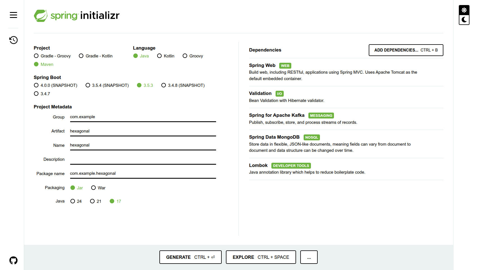
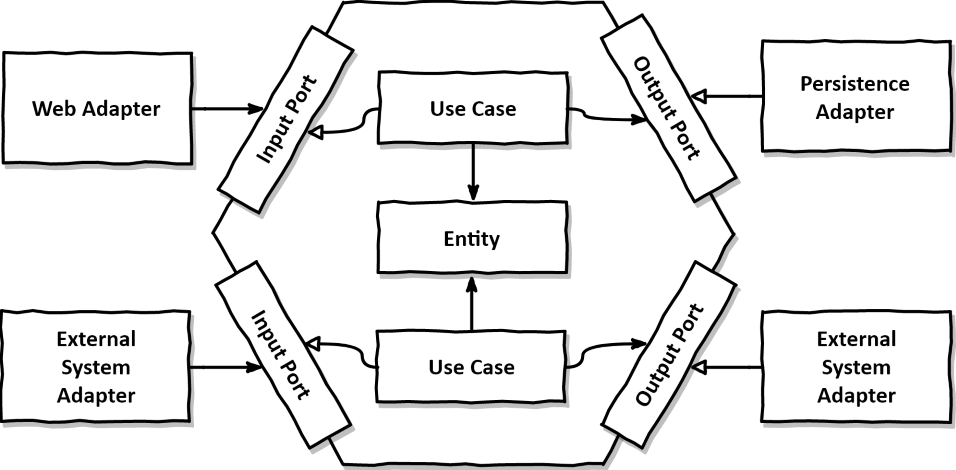

# Tutorial Arquitetura Hexagonal - CRUD de Usuários - Api - MongoDB (nosql) - Kafka(mensageria)

Aprenda na prática como aplicar a arquitetura hexagonal em microsserviços utilizando Java, Spring Boot, MongoDB e Kafka

Seja bem-vindo(a) a este tutorial prático e direto ao ponto sobre Arquitetura Hexagonal! Aqui, você aprenderá como construir um microsserviço moderno e organizado, seguindo boas práticas de engenharia de software com Java, Spring Boot, MongoDB (NoSQL) e Kafka (mensageria).

Nesta primeira parte, nosso foco inicial será configurar a aplicação e baixar as dependências necessárias para começar o desenvolvimento. Vamos preparar o ambiente para que, nos próximos passos, possamos construir o domínio da aplicação, implementar o CRUD e integrar com MongoDB e Kafka com facilidade.

# Parte 1: Start no projeto java com spring boot

Spring Boot é um framework Java que facilita a criação de aplicações web e APIs.

Por que usar?
Evita configurações manuais (auto-configuração)
Já vem com servidor embutido (ex: Tomcat)
Permite criar aplicações com poucos arquivos
Perfeito para criar APIs REST rápidas

Comparando:
Sem Spring Boot = muita configuração
Com Spring Boot = produtividade e simplicidade

## Criando o Projeto no Spring Initializr

O Spring Initializr é uma ferramenta online para gerar rapidamente projetos Spring Boot com as configurações básicas prontas.

**Passo 1: Acesse https://start.spring.io/**

**Passo 2: Configure o projeto com as seguintes opções:**

-   **Project**: Maven
-   **Language**: Java
-   **Spring Boot**: 3.2.5 (ou versão mais recente estável)
-   **Project Metadata**:
    -   Group: `com.example`
    -   Artifact: `hexagonal`
    -   Name: `hexagonal`
    -   Description: ``
    -   Package name: `com.example.hexagonal`
    -   Packaging: `Jar`
    -   Java: `17` (ou 21)

**Passo 3: Adicione as seguintes dependências:**

```
   - Spring Web
   - Validation
   - Spring for Apache Kafka
   - Spring Data MongoDB
   - Lombok
```

No contexto do Java e do Spring Boot:
Dependência = Biblioteca externa que seu projeto precisa para funcionar.
Essas bibliotecas são adicionadas automaticamente pelo Maven (ou Gradle), usando o arquivo pom.xml.



**Passo 4: Clique em "GENERATE" para baixar o projeto**

**Passo 5: Extraia o arquivo ZIP e abra no seu IDE favorito**

# Parte 2: Adicionando mais dependências

**Passo 1: Acesse o arquivo pom.xml**

Adicione:

1.  Adicionar o Spring Cloud BOM (Bill of Materials)
    Adicione no <dependencyManagement>:

```
<dependencyManagement>
    <dependencies>
        <dependency>
            <groupId>org.springframework.cloud</groupId>
            <artifactId>spring-cloud-dependencies</artifactId>
            <version>2023.0.1</version> <!-- Versão compatível com Spring Boot 3.2.x -->
            <type>pom</type>
            <scope>import</scope>
        </dependency>
    </dependencies>
</dependencyManagement>
```

2.  Adicionar as dependências no <dependencies>
    Spring Cloud OpenFeign e MapStruct

```
<dependency>
    <groupId>org.springframework.cloud</groupId>
    <artifactId>spring-cloud-starter-openfeign</artifactId>
</dependency>
<dependency>
    <groupId>org.mapstruct</groupId>
    <artifactId>mapstruct</artifactId>
    <version>1.5.5.Final</version>
</dependency>
<dependency>
    <groupId>org.mapstruct</groupId>
    <artifactId>mapstruct-processor</artifactId>
    <version>1.5.5.Final</version>
    <scope>provided</scope>
</dependency>
```

# Parte 3: Criando a Estrutura do projeto

Utilizaremos as camadas:

```text
│ ├── application/ # 💡 Camada de aplicação: orquestra os casos de uso, conectando domínio e interfaces externas
│ ├── domain/ # 🧠 Camada de domínio: entidades, regras de negócio puras e invariantes da aplicação
│ ├── infrastructure/ # 🛠️ Camada de infraestrutura: implementação técnica dos adaptadores que se comunicam com o exterior
```

**Passo 1: Veja como esta a sua estrura de arquivos atual do seu projeto**

```
meu-projeto/
├── src/
│   ├── main/
│   │   ├── java/
│   │   │   └── com/exemplo/hexagonal/
│   │   │       └── HexagonalApplication.java
│   │   └── resources/
│   │       ├── application.properties
│   │       └── static/
│   │       └── templates/
│   └── test/
├── pom.xml
└── README.md
```

**Passo 2: Crie a seguinte Estrutura de pastas do projeto**

Iremos criar:

-   Domain
-   Application com as portas de entrada e saída para acessar a aplicação
-   Infrastructure com os adapatadores:
    -   Adaptadores de entradas que serão um consumidor de filas e um controlador.
    -   Adaptadores de saídas que serão um cliente para acessar um serviço externo e de repositorio para acessar o banco de dados
-   Configurações do projeto

*Portas são interfaces (contratos)
*Adaptadores implementação das interfaces (classes concretas)

```text
├── hexagonal/
│   ├── application/                        # 💡 Camada de aplicação: orquestra os casos de uso, conectando domínio e interfaces externas
│   │   ├── port/                           # 🚪 Portas (interfaces): contratos que definem como a aplicação se comunica com o mundo externo
│   │   │   ├── input/                      # ↩️ Portas de entrada: interfaces dos casos de uso oferecidos (ex: CriarUsuarioPort)
│   │   │   └── output/                     # ↪️ Portas de saída: interfaces para serviços externos (ex: UsuarioRepositoryPort)
│   │   └── usecase/                        # ⚙️ Implementações dos casos de uso definidos nas portas de entrada (ex: CriarUsuarioUseCase)
│
│   ├── domain/                             # 🧠 Camada de domínio: entidades e regras de negócio puras, independentes de tecnologia
│
│   ├── infrastructure/                     # 🛠️ Camada de infraestrutura: conecta a aplicação ao mundo externo (web, banco, serviços, etc)
│   │   ├── adapter/                        # 🔌 Adaptadores concretos (entrada e saída)
│   │   │   ├── input/                      # 🌐 Adaptadores de entrada (ex: controllers, consumers de eventos)
│   │   │   │   ├── controller/             #     → Controladores REST (ex: UsuarioController)
│   │   │   │   └── consumer/               #     → Consumidores de eventos (ex: KafkaConsumer)
│   │   │   └── output/                     # 🗄️ Adaptadores de saída (ex: repositórios, clientes HTTP)
│   │   │       ├── repository/             #     → Implementações de persistência (ex: JPA/Hibernate)
│   │   │       └── client/                 #     → Clientes para comunicação com outros serviços (ex: OpenFeign, REST)
│
│   ├── config/                             # ⚙️ Configurações gerais da aplicação (ex: beans, segurança, CORS, etc.)
│
│   └── HexagonalApplication.java           # 🚀 Classe principal da aplicação Spring Boot (ponto de entrada)

```

**Domain(Entity)** entidades e regras de negócios
**Application** será formado pelos usecases e terá portas de entradas e saídas para acessar o usecase
**Camada application e domain(Entity)** não terão acesso ao mundo externo e estará livre de framework (dependências de tecnologias)
**Camada infrastructure** conterá os adaptadores de entrada e saída que são as implementações das portas de entradas e saídas da aplicação

**Camada infrastructure** camada externa da aplicação
Como entra dados?
Pelos adaptadores de entrada
As entradas que podem ser pela controler, por uma fila...
Como sai dados?
Pelos adaptadores de saídas
As saídas que podem ser para acessar uma base de dados, uma requisição em outro serviço(api), produzir mensagem em uma fila...
**Camada Application** camada externa da aplicação
Como entra e sai dados na aplicação?
Pelas portas de entrda e saída



Claro! Aqui está o trecho reorganizado, com melhor fluidez, clareza didática e padronização no estilo:

---

### 🔄 Próximos Passos: Criação do CRUD de Clientes

Nos próximos passos, você irá aprender como **aplicar na prática a Arquitetura Hexagonal** em um microsserviço que se comunica com:

-   **Outros serviços e clientes externos**
-   **Banco de dados NoSQL** (utilizaremos o **MongoDB**)
-   **Mensageria assíncrona** (com o **Apache Kafka**)

Durante o curso, utilizaremos a linguagem **Java** com **Spring Boot**, mas os conceitos ensinados se aplicam facilmente a qualquer linguagem **orientada a objetos**.

### 🛠️ O que será abordado nas próximas seções:

2. **Criação dos Domínios**
   Definiremos as entidades centrais da aplicação e suas regras de negócio.

3. **Implementação dos Casos de Uso (Use Cases)**
   Orquestraremos as operações principais do sistema com foco na lógica de aplicação.

4. **Criação dos Adapters**
   Implementaremos as entradas (como controllers) e saídas (como persistência e mensageria) da aplicação, respeitando o princípio da inversão de dependência.

5. **Construção dos Controllers**
   Exporão os endpoints da API REST para interação com clientes externos.

6. **Configuração da Mensageria**
   Criação dos **consumidores e produtores Kafka**, que permitirão a comunicação assíncrona entre sistemas.
